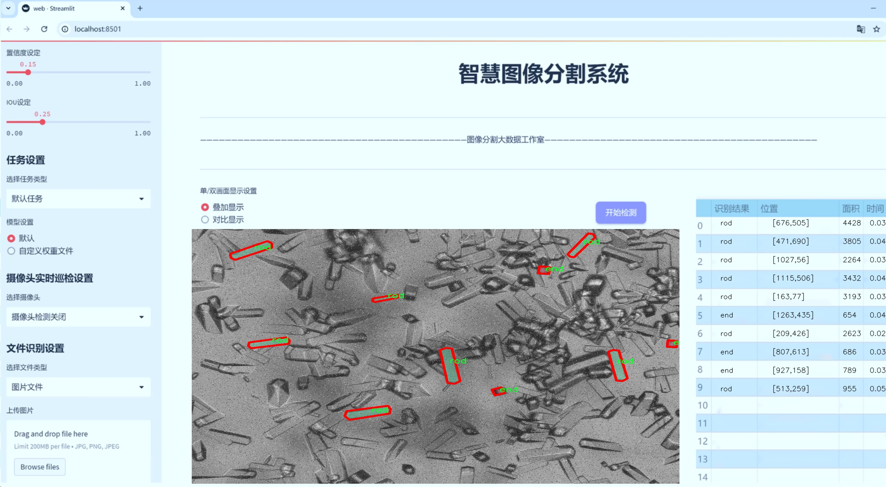
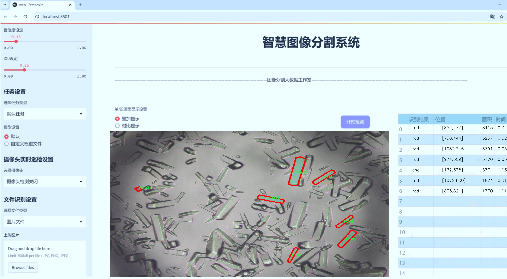
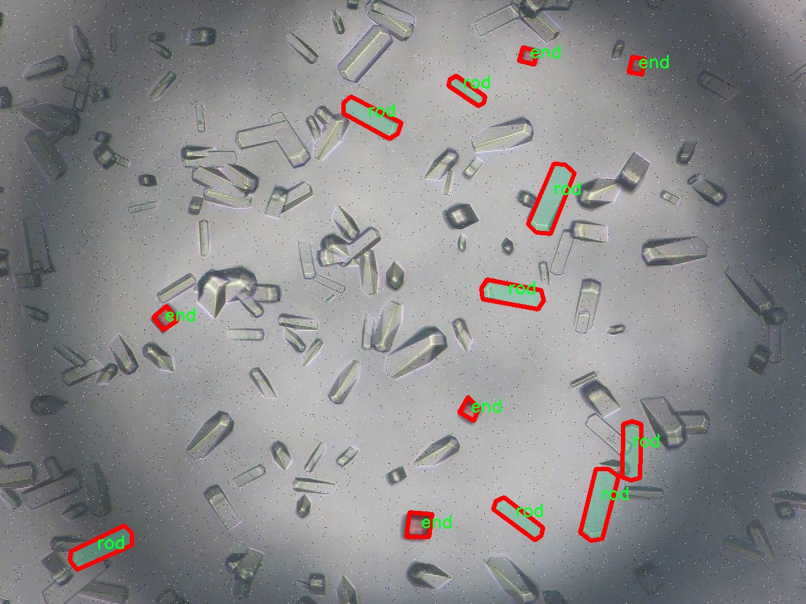
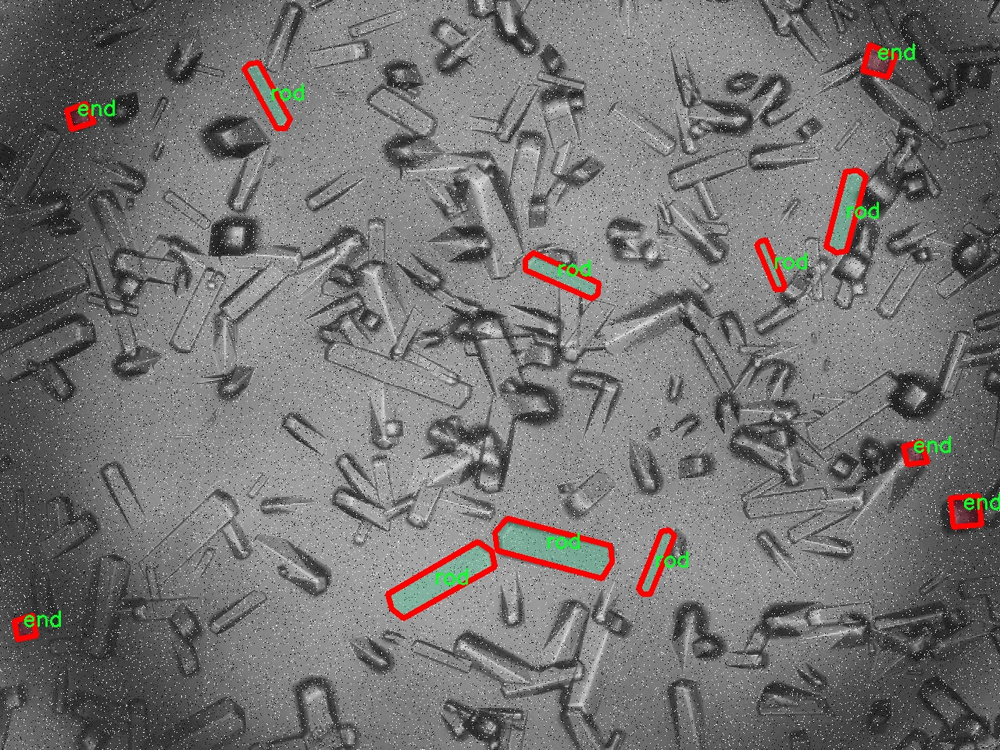
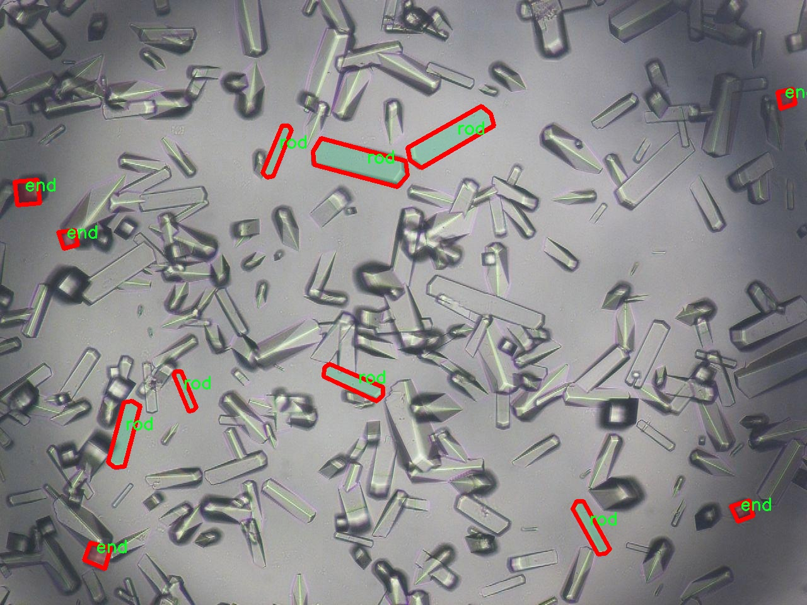
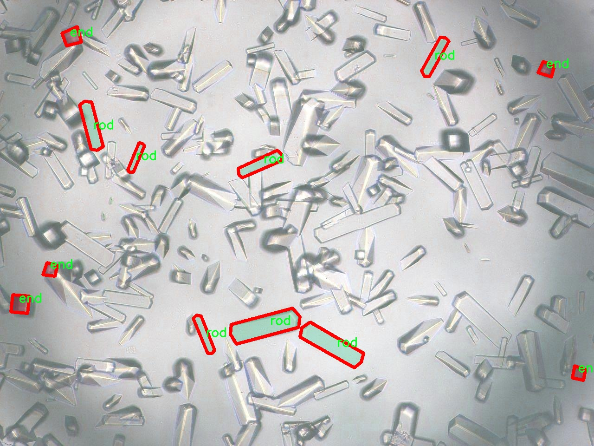
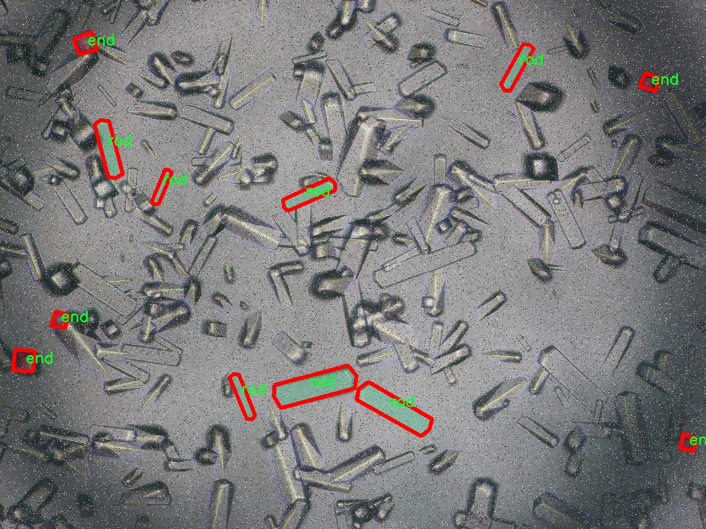

# 水晶图像分割系统源码＆数据集分享
 [yolov8-seg-KernelWarehouse＆yolov8-seg-C2f-DiverseBranchBlock等50+全套改进创新点发刊_一键训练教程_Web前端展示]

### 1.研究背景与意义

项目参考[ILSVRC ImageNet Large Scale Visual Recognition Challenge](https://gitee.com/YOLOv8_YOLOv11_Segmentation_Studio/projects)

项目来源[AAAI Global Al lnnovation Contest](https://kdocs.cn/l/cszuIiCKVNis)

研究背景与意义

随着计算机视觉技术的迅猛发展，图像分割作为其核心任务之一，已经在多个领域中展现出广泛的应用潜力。尤其是在医学影像分析、自动驾驶、智能监控等领域，图像分割技术的准确性和效率直接影响到后续决策的质量与安全性。近年来，基于深度学习的目标检测与分割算法，如YOLO（You Only Look Once）系列，因其出色的实时性和高效性而备受关注。YOLOv8作为该系列的最新版本，结合了更为先进的网络结构和训练策略，展现出更强的特征提取能力和分割精度。然而，尽管YOLOv8在许多应用场景中表现优异，但在特定领域，尤其是水晶图像的分割任务中，仍然存在一些挑战。

水晶图像的分割任务具有其独特性。水晶的形态、颜色和透明度等特征，使得其在图像中往往呈现出复杂的背景和多样的纹理。这种复杂性不仅增加了分割的难度，也对模型的泛化能力提出了更高的要求。针对这一问题，基于改进YOLOv8的水晶图像分割系统的研究显得尤为重要。通过对YOLOv8进行改进，可以增强其在水晶图像分割中的表现，提升分割的准确性和效率。

本研究所使用的数据集包含1900幅图像，涵盖了6个类别，具体分类为0至5。这一数据集的构建为模型的训练和评估提供了坚实的基础。数据集的丰富性和多样性使得模型能够在不同的水晶类型和背景条件下进行有效的学习，从而提高其在实际应用中的适应性和鲁棒性。此外，数据集中不同类别的划分，有助于模型在进行实例分割时，能够更好地识别和区分不同类型的水晶，进而实现更为精细的分割效果。

本研究的意义不仅在于提升水晶图像分割的技术水平，更在于推动相关领域的应用发展。通过实现高效、准确的水晶图像分割系统，可以为矿物学、材料科学等领域提供更为精准的数据支持，助力科学研究和工业应用的进步。同时，该系统的成功实现也为其他复杂图像分割任务提供了借鉴，推动了深度学习在图像处理领域的进一步应用。

综上所述，基于改进YOLOv8的水晶图像分割系统的研究，具有重要的理论价值和实际意义。它不仅为解决特定领域的实际问题提供了有效的技术方案，也为计算机视觉领域的研究者提供了新的思路和方法，推动了相关技术的不断进步与创新。

### 2.图片演示






##### 注意：由于此博客编辑较早，上面“2.图片演示”和“3.视频演示”展示的系统图片或者视频可能为老版本，新版本在老版本的基础上升级如下：（实际效果以升级的新版本为准）

  （1）适配了YOLOV8的“目标检测”模型和“实例分割”模型，通过加载相应的权重（.pt）文件即可自适应加载模型。

  （2）支持“图片识别”、“视频识别”、“摄像头实时识别”三种识别模式。

  （3）支持“图片识别”、“视频识别”、“摄像头实时识别”三种识别结果保存导出，解决手动导出（容易卡顿出现爆内存）存在的问题，识别完自动保存结果并导出到tempDir中。

  （4）支持Web前端系统中的标题、背景图等自定义修改，后面提供修改教程。

  另外本项目提供训练的数据集和训练教程,暂不提供权重文件（best.pt）,需要您按照教程进行训练后实现图片演示和Web前端界面演示的效果。

### 3.视频演示

[3.1 视频演示](https://www.bilibili.com/video/BV1bfDAYZE9K/)

### 4.数据集信息展示

##### 4.1 本项目数据集详细数据（类别数＆类别名）

nc: 6
names: ['cubic', 'end', 'plate', 'rod', 'sheet', 'tail']


##### 4.2 本项目数据集信息介绍

数据集信息展示

在现代计算机视觉领域，图像分割技术的进步为多种应用场景提供了强有力的支持，尤其是在物体识别和分类方面。为了推动水晶图像分割系统的进一步发展，本研究采用了名为“type0526”的数据集，该数据集专门用于训练和改进YOLOv8-seg模型，以实现对水晶图像的精准分割。该数据集的构建旨在涵盖多种水晶形态，以便模型能够学习到不同形状和特征的水晶物体。

“type0526”数据集包含六个类别，分别为“cubic”（立方体）、“end”（端部）、“plate”（板）、“rod”（棒）、“sheet”（薄片）和“tail”（尾部）。这些类别代表了水晶的不同几何形状和结构特征，涵盖了从常见的立方体形状到更复杂的薄片和尾部结构。通过多样化的类别设置，数据集为模型提供了丰富的训练样本，使其能够在不同的视觉场景中表现出色。

在数据集的构建过程中，研究团队精心挑选了多种水晶样本，确保每个类别的样本数量均衡，并且涵盖了不同的拍摄角度、光照条件和背景环境。这种多样性不仅增强了模型的泛化能力，还使其能够在实际应用中更好地适应不同的环境变化。每个类别的样本都经过精确标注，确保模型在训练过程中能够获得准确的目标信息，从而提高分割的精度。

为了更好地评估模型的性能，数据集还划分为训练集、验证集和测试集。训练集用于模型的学习和参数调整，验证集用于实时监控模型的训练效果，而测试集则用于最终的性能评估。这种划分策略确保了模型在训练过程中不会过拟合，同时也能够在未见过的数据上进行有效的测试，确保其在实际应用中的可靠性。

在数据预处理阶段，研究团队对图像进行了标准化处理，包括尺寸调整、数据增强等，以提高模型的鲁棒性。数据增强技术如随机裁剪、旋转、翻转等，能够有效增加训练样本的多样性，进一步提升模型的学习能力。这些预处理步骤为后续的模型训练奠定了坚实的基础，使得YOLOv8-seg能够在水晶图像分割任务中表现出更高的准确性和效率。

总之，“type0526”数据集为改进YOLOv8-seg的水晶图像分割系统提供了丰富的训练资源和多样化的样本，使得模型能够在不同形态的水晶物体上进行有效的分割。通过精心设计的类别设置和严格的数据处理流程，该数据集不仅提升了模型的性能，也为后续的研究和应用提供了重要的参考依据。随着技术的不断进步，期望这一数据集能够为水晶图像分割领域带来更多的创新和突破。











### 5.全套项目环境部署视频教程（零基础手把手教学）

[5.1 环境部署教程链接（零基础手把手教学）](https://www.bilibili.com/video/BV1jG4Ve4E9t/?vd_source=bc9aec86d164b67a7004b996143742dc)


[5.2 安装Python虚拟环境创建和依赖库安装视频教程链接（零基础手把手教学）](https://www.bilibili.com/video/BV1nA4VeYEze/?vd_source=bc9aec86d164b67a7004b996143742dc)

### 6.手把手YOLOV8-seg训练视频教程（零基础小白有手就能学会）

[6.1 手把手YOLOV8-seg训练视频教程（零基础小白有手就能学会）](https://www.bilibili.com/video/BV1cA4VeYETe/?vd_source=bc9aec86d164b67a7004b996143742dc)


按照上面的训练视频教程链接加载项目提供的数据集，运行train.py即可开始训练



     Epoch   gpu_mem       box       obj       cls    labels  img_size
     1/200     0G   0.01576   0.01955  0.007536        22      1280: 100%|██████████| 849/849 [14:42<00:00,  1.04s/it]
               Class     Images     Labels          P          R     mAP@.5 mAP@.5:.95: 100%|██████████| 213/213 [01:14<00:00,  2.87it/s]
                 all       3395      17314      0.994      0.957      0.0957      0.0843

     Epoch   gpu_mem       box       obj       cls    labels  img_size
     2/200     0G   0.01578   0.01923  0.007006        22      1280: 100%|██████████| 849/849 [14:44<00:00,  1.04s/it]
               Class     Images     Labels          P          R     mAP@.5 mAP@.5:.95: 100%|██████████| 213/213 [01:12<00:00,  2.95it/s]
                 all       3395      17314      0.996      0.956      0.0957      0.0845

     Epoch   gpu_mem       box       obj       cls    labels  img_size
     3/200     0G   0.01561    0.0191  0.006895        27      1280: 100%|██████████| 849/849 [10:56<00:00,  1.29it/s]
               Class     Images     Labels          P          R     mAP@.5 mAP@.5:.95: 100%|███████   | 187/213 [00:52<00:00,  4.04it/s]
                 all       3395      17314      0.996      0.957      0.0957      0.0845


### 7.50+种全套YOLOV8-seg创新点代码加载调参视频教程（一键加载写好的改进模型的配置文件）

[7.1 50+种全套YOLOV8-seg创新点代码加载调参视频教程（一键加载写好的改进模型的配置文件）](https://www.bilibili.com/video/BV1Hw4VePEXv/?vd_source=bc9aec86d164b67a7004b996143742dc)

### 8.YOLOV8-seg图像分割算法原理

原始YOLOv8-seg算法原理

YOLOv8-seg算法是YOLO系列的最新版本，标志着目标检测和实例分割领域的一次重要飞跃。自2015年YOLO模型首次推出以来，YOLO系列经历了多个版本的迭代，每个版本都在速度、精度和易用性上不断优化。YOLOv8作为最新的代表，凭借其卓越的性能和灵活的架构，成为了计算机视觉领域的热门选择。

YOLOv8的网络结构由三个主要部分组成：Backbone（骨干网络）、Neck（颈部结构）和Head（头部结构）。Backbone负责从输入图像中提取特征，这一过程是模型性能的基础。YOLOv8引入了新的C2f模块替代了YOLOv5中的C3模块，这一改变不仅提高了特征提取的效率，还增加了网络的表达能力。C2f模块通过引入更多的跳层连接和Split操作，使得信息流动更加顺畅，从而增强了特征的多样性和丰富性。

Neck部分则负责特征的融合。YOLOv8采用了PAN-FPN（Path Aggregation Network - Feature Pyramid Network）结构，这种设计允许模型在不同尺度上进行特征的有效融合，确保了对各种大小目标的检测能力。PAN-FPN通过自底向上的路径聚合特征，使得高层特征和低层特征能够有效结合，从而提升了模型对复杂场景的适应性。

在Head部分，YOLOv8实现了从Anchor-Based到Anchor-Free的转变，采用了解耦头结构。这一创新使得模型在进行目标检测时不再依赖于预设的锚框，而是直接从特征图中进行分类和回归。这种方法不仅简化了模型的设计，还提高了推理速度和精度。YOLOv8的Head部分专注于将检测任务分为分类和回归两个独立的分支，这种解耦设计使得模型在处理复杂场景时能够更为灵活。

YOLOv8的损失函数也进行了改进，采用了CloU损失，这一损失函数在目标检测任务中表现出色，能够有效提升模型的收敛速度和最终精度。通过对损失函数的优化，YOLOv8在训练过程中能够更好地捕捉到目标的特征，从而提高了模型的整体性能。

在模型设置方面，YOLOv8提供了多个可调参数，如depth_factor、width_factor和ratio。这些参数允许用户根据具体应用场景灵活调整模型的深度和宽度，以满足不同的计算资源和精度需求。例如，depth_factor的设置直接影响到模型的层数，较大的值将使网络变得更深，从而提升其表达能力；而width_factor则控制了每层的通道数，影响到特征的丰富性和计算量。

YOLOv8还具备更广泛的硬件支持，能够在从CPU到GPU的多种平台上高效运行。这一特性使得YOLOv8在实际应用中具有更强的灵活性和适应性，能够满足不同用户的需求。无论是在资源受限的移动设备上，还是在高性能的服务器上，YOLOv8都能展现出优异的性能。

在实例分割任务中，YOLOv8-seg算法的表现同样令人瞩目。通过在YOLOv8的基础上增加分割头，YOLOv8-seg能够同时完成目标检测和实例分割任务。这一能力使得YOLOv8-seg在复杂场景下的应用更加广泛，如自动驾驶、智能监控和医疗影像分析等领域。

总的来说，YOLOv8-seg算法通过一系列创新和优化，不仅提升了目标检测的精度和速度，还扩展了其在实例分割领域的应用潜力。其灵活的架构设计和高效的特征提取能力，使得YOLOv8-seg成为当前计算机视觉领域中最具竞争力的模型之一。随着技术的不断进步，YOLOv8-seg有望在更多实际应用中发挥重要作用，推动智能视觉技术的发展。


### 9.系统功能展示（检测对象为举例，实际内容以本项目数据集为准）

图9.1.系统支持检测结果表格显示

  图9.2.系统支持置信度和IOU阈值手动调节

  图9.3.系统支持自定义加载权重文件best.pt(需要你通过步骤5中训练获得)

  图9.4.系统支持摄像头实时识别

  图9.5.系统支持图片识别

  图9.6.系统支持视频识别

  图9.7.系统支持识别结果文件自动保存

  图9.8.系统支持Excel导出检测结果数据


### 10.50+种全套YOLOV8-seg创新点原理讲解（非科班也可以轻松写刊发刊，V11版本正在科研待更新）

#### 10.1 由于篇幅限制，每个创新点的具体原理讲解就不一一展开，具体见下列网址中的创新点对应子项目的技术原理博客网址【Blog】：


[10.1 50+种全套YOLOV8-seg创新点原理讲解链接](https://gitee.com/qunmasj/good)

#### 10.2 部分改进模块原理讲解(完整的改进原理见上图和技术博客链接)【如果此小节的图加载失败可以通过CSDN或者Github搜索该博客的标题访问原始博客，原始博客图片显示正常】
### 全维动态卷积ODConv
鉴于上述讨论，我们的ODConv引入了一种多维注意机制，该机制具有并行策略，用于学习卷积核在核空间的所有四个维度上的不同注意。图提供了CondConv、DyConv和ODConv的示意性比较。

ODConv的公式：根据等式1中的符号，ODConv可定义为


 将注意力标量分配给整个卷积核。图2示出了将这四种类型的关注乘以n个卷积核的过程。原则上，这四种类型的关注是相互补充的，并且以位置、信道、滤波器和核的顺序将它们逐步乘以卷积核 
 ，使得卷积运算不同w.r.t.所有空间位置、所有输入信道、所有滤波器和输入x的所有核，提供捕获丰富上下文线索的性能保证。因此，ODConv可以显著增强CNN基本卷积运算的特征提取能力。此外，具有单个卷积核的ODConv可以与标准CondConv和DyConv竞争或优于它们，为最终模型引入的额外参数大大减少。提供了大量实验来验证这些优点。通过比较等式1和等式2，我们可以清楚地看到，ODConv是一种更广义的动态卷积。此外，当设置n=1且 所有分量均为1时，只关注滤波器方向 的ODConv将减少为：将基于输入特征的SE变量应用于卷积滤波器，然后进行卷积运算（注意原始SE（Hu等人，2018b）基于输出特征，并且用于重新校准输出特征本身）。这种SE变体是ODConv的特例。


图：将ODConv中的四种注意类型逐步乘以卷积核的示例。（a） 沿空间维度的逐位置乘法运算，（b）沿输入信道维度的逐信道乘法运算、（c）沿输出信道维度的按滤波器乘法运算，以及（d）沿卷积核空间的核维度的按核乘法运算。方法部分对符号进行了说明
实现：对于ODConv，一个关键问题是如何计算卷积核的四种关注度 。继CondConv和DyConv之后，我们还使用SE型注意力模块（Hu等人，2018b），但将多个头部作为来计算它们，其结构如图所示。具体而言，首先通过逐通道全局平均池（GAP）运算将输入压缩到具有长度的特征向量中。随后，存在完全连接（FC）层和四个头部分支。ReLU（Krizhevsky等人，2012）位于FC层之后。FC层将压缩特征向量映射到具有缩减比的低维空间（根据消融实验，我们在所有主要实验中设置 ，避免了高模型复杂度）。对于四个头部分支，每个分支都有一个输出大小如图。

### 引入ODConv的改进YOLO
参考这篇博客涵盖了引入ODConv的改进YOLOv8系统的内容，ODConv采用多维注意机制，在卷积核空间的四个维度上学习不同的注意。结合了CondConv和DyConv的优势，ODConv通过图示的四种注意类型逐步与卷积核相乘，以捕获丰富的上下文线索，提升特征提取能力。

#### ODConv结构与方法
ODConv的公式和图示展示了其关注力分配给卷积核的方式，其中四种类型的关注以位置、信道、滤波器和核的顺序逐步与卷积核相乘。这种结构保证了卷积运算不同于标准的Conv操作，能够捕获更多上下文信息，从而增强了CNN的特征提取能力。另外，单个卷积核的ODConv在性能上能够与CondConv和DyConv相竞争，并且引入的额外参数大幅减少。

ODConv的特殊之处在于其广义的动态卷积性质，同时在特定条件下（n=1且所有分量为1），它可以退化为一种特例，即只关注滤波器方向，这类似于基于输入特征的SE变体，但不同于原始SE，它基于输出特征。

#### ODConv的实现
关键问题在于如何计算卷积核的四种关注度。ODConv采用了SE型注意力模块，结合了多个头部来计算这些关注度。具体实现上，通过逐通道全局平均池运算和完全连接层，将输入压缩为特征向量，随后使用四个头部分支来计算四种不同类型的关注。这样的结构能在保持模型复杂度可控的情况下，提升了特征的表征能力。

ODConv的引入为YOLOv8带来了显著的性能提升，并且通过大量实验证明了其在特征提取方面的优越性。其结合了多维注意机制和卷积操作，为目标检测和分拣系统的提升带来了新的思路和性能突破。


### 11.项目核心源码讲解（再也不用担心看不懂代码逻辑）

#### 11.1 ultralytics\models\yolo\model.py

```python
# Ultralytics YOLO 🚀, AGPL-3.0 license

from ultralytics.engine.model import Model  # 导入基础模型类
from ultralytics.models import yolo  # 导入YOLO模型相关模块
from ultralytics.nn.tasks import ClassificationModel, DetectionModel, PoseModel, SegmentationModel  # 导入不同任务的模型类


class YOLO(Model):
    """YOLO (You Only Look Once) 目标检测模型类。"""

    @property
    def task_map(self):
        """将任务类型映射到相应的模型、训练器、验证器和预测器类。"""
        return {
            'classify': {  # 分类任务
                'model': ClassificationModel,  # 分类模型
                'trainer': yolo.classify.ClassificationTrainer,  # 分类训练器
                'validator': yolo.classify.ClassificationValidator,  # 分类验证器
                'predictor': yolo.classify.ClassificationPredictor,  # 分类预测器
            },
            'detect': {  # 检测任务
                'model': DetectionModel,  # 检测模型
                'trainer': yolo.detect.DetectionTrainer,  # 检测训练器
                'validator': yolo.detect.DetectionValidator,  # 检测验证器
                'predictor': yolo.detect.DetectionPredictor,  # 检测预测器
            },
            'segment': {  # 分割任务
                'model': SegmentationModel,  # 分割模型
                'trainer': yolo.segment.SegmentationTrainer,  # 分割训练器
                'validator': yolo.segment.SegmentationValidator,  # 分割验证器
                'predictor': yolo.segment.SegmentationPredictor,  # 分割预测器
            },
            'pose': {  # 姿态估计任务
                'model': PoseModel,  # 姿态模型
                'trainer': yolo.pose.PoseTrainer,  # 姿态训练器
                'validator': yolo.pose.PoseValidator,  # 姿态验证器
                'predictor': yolo.pose.PosePredictor,  # 姿态预测器
            },
        }
```

### 代码核心部分分析

1. **YOLO类**: 该类继承自`Model`，表示YOLO目标检测模型的实现。
   
2. **task_map属性**: 该属性返回一个字典，映射不同的任务类型（如分类、检测、分割和姿态估计）到相应的模型、训练器、验证器和预测器类。这使得在使用YOLO模型时，可以根据任务类型动态选择合适的组件。

3. **任务类型映射**:
   - **分类**: 包含分类模型、训练器、验证器和预测器。
   - **检测**: 包含检测模型、训练器、验证器和预测器。
   - **分割**: 包含分割模型、训练器、验证器和预测器。
   - **姿态**: 包含姿态模型、训练器、验证器和预测器。

### 注释说明
- 每个任务类型的映射都提供了相应的模型和工具，便于在不同的计算机视觉任务中使用YOLO框架。

这个文件定义了一个名为 `YOLO` 的类，它是一个用于目标检测的模型，基于 YOLO（You Only Look Once）算法。该类继承自 `Model` 类，表明它是一个更具体的模型实现。

在 `YOLO` 类中，有一个名为 `task_map` 的属性。这个属性是一个字典，映射了不同任务类型（如分类、检测、分割和姿态估计）到相应的模型、训练器、验证器和预测器类。具体来说：

- 对于分类任务，映射到 `ClassificationModel` 及其对应的训练、验证和预测类。
- 对于检测任务，映射到 `DetectionModel` 及其对应的训练、验证和预测类。
- 对于分割任务，映射到 `SegmentationModel` 及其对应的训练、验证和预测类。
- 对于姿态估计任务，映射到 `PoseModel` 及其对应的训练、验证和预测类。

这种设计使得 `YOLO` 类能够灵活地处理不同的计算机视觉任务，并且通过任务映射可以方便地调用相应的模型和工具。这种结构化的方式有助于代码的可维护性和扩展性，使得开发者可以在需要时轻松添加新的任务类型或修改现有的实现。

#### 11.2 ultralytics\models\fastsam\utils.py

以下是代码中最核心的部分，并附上详细的中文注释：

```python
import torch

def adjust_bboxes_to_image_border(boxes, image_shape, threshold=20):
    """
    调整边界框，使其在一定阈值内贴合图像边界。

    参数:
        boxes (torch.Tensor): 边界框坐标，形状为(n, 4)
        image_shape (tuple): 图像的高度和宽度，形状为(height, width)
        threshold (int): 像素阈值

    返回:
        adjusted_boxes (torch.Tensor): 调整后的边界框
    """

    # 获取图像的高度和宽度
    h, w = image_shape

    # 调整边界框，使其贴合图像边界
    boxes[boxes[:, 0] < threshold, 0] = 0  # 将左上角x坐标小于阈值的边界框调整为0
    boxes[boxes[:, 1] < threshold, 1] = 0  # 将左上角y坐标小于阈值的边界框调整为0
    boxes[boxes[:, 2] > w - threshold, 2] = w  # 将右下角x坐标大于图像宽度减去阈值的边界框调整为图像宽度
    boxes[boxes[:, 3] > h - threshold, 3] = h  # 将右下角y坐标大于图像高度减去阈值的边界框调整为图像高度
    return boxes


def bbox_iou(box1, boxes, iou_thres=0.9, image_shape=(640, 640), raw_output=False):
    """
    计算一个边界框与一组其他边界框的交并比（IoU）。

    参数:
        box1 (torch.Tensor): 单个边界框，形状为(4, )
        boxes (torch.Tensor): 其他边界框，形状为(n, 4)
        iou_thres (float): IoU阈值
        image_shape (tuple): 图像的高度和宽度，形状为(height, width)
        raw_output (bool): 如果为True，返回原始IoU值而不是索引

    返回:
        high_iou_indices (torch.Tensor): IoU大于阈值的边界框索引
    """
    # 调整边界框，使其贴合图像边界
    boxes = adjust_bboxes_to_image_border(boxes, image_shape)

    # 计算交集的坐标
    x1 = torch.max(box1[0], boxes[:, 0])  # 交集左上角x坐标
    y1 = torch.max(box1[1], boxes[:, 1])  # 交集左上角y坐标
    x2 = torch.min(box1[2], boxes[:, 2])  # 交集右下角x坐标
    y2 = torch.min(box1[3], boxes[:, 3])  # 交集右下角y坐标

    # 计算交集的面积
    intersection = (x2 - x1).clamp(0) * (y2 - y1).clamp(0)

    # 计算两个边界框的面积
    box1_area = (box1[2] - box1[0]) * (box1[3] - box1[1])  # box1的面积
    box2_area = (boxes[:, 2] - boxes[:, 0]) * (boxes[:, 3] - boxes[:, 1])  # boxes的面积

    # 计算并集的面积
    union = box1_area + box2_area - intersection

    # 计算IoU
    iou = intersection / union  # IoU值，形状为(n, )
    if raw_output:
        return 0 if iou.numel() == 0 else iou  # 如果需要原始IoU值，直接返回

    # 返回IoU大于阈值的边界框索引
    return torch.nonzero(iou > iou_thres).flatten()
```

### 代码核心部分说明：
1. **`adjust_bboxes_to_image_border` 函数**：用于调整边界框的位置，使其在距离图像边界一定阈值内时，强制将其位置调整到图像边界。这对于确保边界框不超出图像范围是必要的。

2. **`bbox_iou` 函数**：计算一个边界框与一组其他边界框的交并比（IoU），这是目标检测中常用的评估指标。函数首先调用 `adjust_bboxes_to_image_border` 来确保所有边界框都在图像范围内，然后计算交集、并集及其面积，最后返回满足IoU阈值的边界框索引。

这个程序文件包含了两个主要的函数，分别用于调整边界框和计算边界框之间的交并比（IoU）。

首先，`adjust_bboxes_to_image_border` 函数的作用是调整给定的边界框，使其在接近图像边界时能够“粘附”到图像的边缘。函数接受三个参数：`boxes` 是一个形状为 (n, 4) 的张量，表示 n 个边界框的坐标；`image_shape` 是一个元组，包含图像的高度和宽度；`threshold` 是一个整数，表示在图像边界内的阈值像素。函数内部首先获取图像的高度和宽度，然后通过比较边界框的坐标与阈值，调整边界框的位置。如果边界框的左上角（x1, y1）坐标小于阈值，则将其设置为 0；如果右下角（x2, y2）坐标超出图像边界，则将其设置为图像的宽度或高度。最后，返回调整后的边界框。

接下来，`bbox_iou` 函数用于计算一个边界框与一组其他边界框之间的交并比。它接受多个参数，包括待计算的边界框 `box1`、其他边界框 `boxes`、IoU 阈值 `iou_thres`、图像的形状 `image_shape` 以及一个布尔值 `raw_output`，用于指示是否返回原始的 IoU 值。函数首先调用 `adjust_bboxes_to_image_border` 来调整 `boxes`，确保它们在图像边界内。然后，函数计算 `box1` 和 `boxes` 之间的交集坐标，并利用这些坐标计算交集的面积。接着，计算两个边界框的面积，并根据交集和并集的面积计算 IoU 值。如果 `raw_output` 为真，函数将返回 IoU 值；否则，返回与 IoU 大于阈值的边界框的索引。

整体来看，这个文件的功能主要是为了处理目标检测中的边界框，确保它们在图像边界内，并计算它们之间的重叠程度，这对于后续的目标检测和筛选过程非常重要。

#### 11.3 ultralytics\utils\callbacks\base.py

以下是经过简化和注释的核心代码部分，主要保留了回调函数的定义和默认回调字典的结构。

```python
# Ultralytics YOLO 🚀, AGPL-3.0 license
"""基础回调函数定义。"""

from collections import defaultdict
from copy import deepcopy

# 定义训练过程中的回调函数
def on_train_start(trainer):
    """训练开始时调用的回调函数。"""
    pass

def on_train_epoch_start(trainer):
    """每个训练周期开始时调用的回调函数。"""
    pass

def on_train_batch_start(trainer):
    """每个训练批次开始时调用的回调函数。"""
    pass

def on_train_batch_end(trainer):
    """每个训练批次结束时调用的回调函数。"""
    pass

def on_train_epoch_end(trainer):
    """每个训练周期结束时调用的回调函数。"""
    pass

def on_train_end(trainer):
    """训练结束时调用的回调函数。"""
    pass

# 默认回调字典，包含训练、验证、预测和导出过程中的回调函数
default_callbacks = {
    'on_train_start': [on_train_start],
    'on_train_epoch_start': [on_train_epoch_start],
    'on_train_batch_start': [on_train_batch_start],
    'on_train_batch_end': [on_train_batch_end],
    'on_train_epoch_end': [on_train_epoch_end],
    'on_train_end': [on_train_end],
}

def get_default_callbacks():
    """
    返回一个包含默认回调的字典，字典的值为默认空列表。

    Returns:
        (defaultdict): 一个默认字典，键来自default_callbacks，值为默认空列表。
    """
    return defaultdict(list, deepcopy(default_callbacks))

def add_integration_callbacks(instance):
    """
    将来自不同来源的集成回调添加到实例的回调中。

    Args:
        instance (Trainer, Predictor, Validator, Exporter): 一个具有'callbacks'属性的对象，该属性是一个回调列表的字典。
    """
    # 加载HUB回调
    from .hub import callbacks as hub_cb
    callbacks_list = [hub_cb]

    # 如果实例是Trainer类型，加载训练相关的回调
    if 'Trainer' in instance.__class__.__name__:
        from .clearml import callbacks as clear_cb
        from .comet import callbacks as comet_cb
        from .dvc import callbacks as dvc_cb
        from .mlflow import callbacks as mlflow_cb
        from .neptune import callbacks as neptune_cb
        from .raytune import callbacks as tune_cb
        from .tensorboard import callbacks as tb_cb
        from .wb import callbacks as wb_cb
        callbacks_list.extend([clear_cb, comet_cb, dvc_cb, mlflow_cb, neptune_cb, tune_cb, tb_cb, wb_cb])

    # 将回调添加到实例的回调字典中
    for callbacks in callbacks_list:
        for k, v in callbacks.items():
            if v not in instance.callbacks[k]:
                instance.callbacks[k].append(v)
```

### 代码注释说明：
1. **回调函数**：定义了一系列回调函数，这些函数在训练、验证和预测的不同阶段被调用。每个函数的实现目前为空（`pass`），可以根据需要填充具体逻辑。
2. **默认回调字典**：`default_callbacks` 字典包含了所有定义的回调函数，便于在训练过程中统一管理和调用。
3. **获取默认回调**：`get_default_callbacks` 函数返回一个深拷贝的默认回调字典，确保每次调用时都能得到一个新的字典实例。
4. **添加集成回调**：`add_integration_callbacks` 函数用于将来自不同库的回调函数集成到实例的回调字典中，便于扩展和使用不同的回调功能。

这个程序文件是一个用于Ultralytics YOLO框架的回调函数模块，主要定义了一系列的回调函数，这些函数在不同的训练、验证、预测和导出阶段被调用。文件中包含了多个回调函数，每个函数都有特定的用途，帮助用户在模型训练和评估的不同阶段插入自定义的操作。

首先，文件导入了`defaultdict`和`deepcopy`，这两个模块分别用于创建具有默认值的字典和深拷贝对象。接下来，定义了一系列与训练过程相关的回调函数。这些函数在训练的不同阶段被调用，例如在训练开始、每个训练周期开始、每个训练批次开始和结束、优化器更新参数之前和之后等。每个函数的实现目前都是空的，意味着用户可以根据需要自定义这些函数的行为。

除了训练回调，文件还定义了验证、预测和导出过程中的回调函数。验证回调函数在验证开始、每个验证批次开始和结束时被调用；预测回调函数在预测开始、每个预测批次开始和结束时被调用；导出回调函数在模型导出开始和结束时被调用。

在文件的最后，定义了一个`default_callbacks`字典，包含了所有的回调函数，并将它们分类为训练、验证、预测和导出。这个字典为用户提供了一个方便的方式来访问和管理这些回调函数。

`get_default_callbacks`函数返回一个深拷贝的`default_callbacks`字典，确保用户可以获得一个初始的回调列表而不影响原始字典。

`add_integration_callbacks`函数用于将来自不同来源的集成回调添加到给定实例的回调字典中。这个函数首先加载一些特定的回调模块，然后根据实例的类型（如Trainer、Predictor等）将相关的回调函数添加到实例的回调字典中。

总体而言，这个文件为Ultralytics YOLO框架提供了一个灵活的回调机制，允许用户在模型训练和评估的各个阶段插入自定义的操作，从而增强模型的训练和验证过程。

#### 11.4 ultralytics\utils\metrics.py

以下是经过简化和注释的核心代码部分，主要集中在计算框的交并比（IoU）及相关的度量指标上：

```python
import numpy as np
import torch

def box_iou(box1, box2, eps=1e-7):
    """
    计算两个框的交并比（IoU）。
    
    参数:
        box1 (torch.Tensor): 形状为 (N, 4) 的张量，表示 N 个边界框。
        box2 (torch.Tensor): 形状为 (M, 4) 的张量，表示 M 个边界框。
        eps (float, optional): 避免除以零的小值，默认为 1e-7。

    返回:
        (torch.Tensor): 形状为 (N, M) 的张量，表示 box1 和 box2 中每对框的 IoU 值。
    """
    # 提取框的坐标
    (a1, a2), (b1, b2) = box1.unsqueeze(1).chunk(2, 2), box2.unsqueeze(0).chunk(2, 2)
    
    # 计算交集区域
    inter = (torch.min(a2, b2) - torch.max(a1, b1)).clamp_(0).prod(2)

    # 计算 IoU = 交集 / (框1面积 + 框2面积 - 交集)
    return inter / ((a2 - a1).prod(2) + (b2 - b1).prod(2) - inter + eps)

def bbox_iou(box1, box2, xywh=True, eps=1e-7):
    """
    计算 box1 (1, 4) 和 box2 (n, 4) 的交并比（IoU）。

    参数:
        box1 (torch.Tensor): 形状为 (1, 4) 的张量，表示单个边界框。
        box2 (torch.Tensor): 形状为 (n, 4) 的张量，表示 n 个边界框。
        xywh (bool, optional): 如果为 True，输入框为 (x, y, w, h) 格式；如果为 False，输入框为 (x1, y1, x2, y2) 格式。默认为 True。
        eps (float, optional): 避免除以零的小值，默认为 1e-7。

    返回:
        (torch.Tensor): IoU 值。
    """
    # 将 (x, y, w, h) 转换为 (x1, y1, x2, y2) 格式
    if xywh:
        (x1, y1, w1, h1), (x2, y2, w2, h2) = box1.chunk(4, -1), box2.chunk(4, -1)
        b1_x1, b1_x2, b1_y1, b1_y2 = x1 - w1 / 2, x1 + w1 / 2, y1 - h1 / 2, y1 + h1 / 2
        b2_x1, b2_x2, b2_y1, b2_y2 = x2 - w2 / 2, x2 + w2 / 2, y2 - h2 / 2, y2 + h2 / 2
    else:
        b1_x1, b1_y1, b1_x2, b1_y2 = box1.chunk(4, -1)
        b2_x1, b2_y1, b2_x2, b2_y2 = box2.chunk(4, -1)

    # 计算交集区域
    inter = (b1_x2.minimum(b2_x2) - b1_x1.maximum(b2_x1)).clamp_(0) * \
            (b1_y2.minimum(b2_y2) - b1_y1.maximum(b2_y1)).clamp_(0)

    # 计算并集区域
    union = (b1_x2 - b1_x1) * (b1_y2 - b1_y1 + eps) + (b2_x2 - b2_x1) * (b2_y2 - b2_y1 + eps) - inter + eps

    # 返回 IoU
    return inter / union

def compute_ap(recall, precision):
    """
    计算平均精度（AP），给定召回率和精度曲线。

    参数:
        recall (list): 召回率曲线。
        precision (list): 精度曲线。

    返回:
        (float): 平均精度。
    """
    # 在开头和结尾添加哨兵值
    mrec = np.concatenate(([0.0], recall, [1.0]))
    mpre = np.concatenate(([1.0], precision, [0.0]))

    # 计算精度包络
    mpre = np.flip(np.maximum.accumulate(np.flip(mpre)))

    # 计算曲线下面积
    ap = np.trapz(np.interp(np.linspace(0, 1, 101), mrec, mpre), np.linspace(0, 1, 101))
    return ap
```

### 代码说明：
1. **box_iou**: 计算两个边界框之间的交并比（IoU），用于评估目标检测的准确性。
2. **bbox_iou**: 计算单个边界框与多个边界框之间的 IoU，支持两种格式的输入。
3. **compute_ap**: 计算给定召回率和精度曲线的平均精度（AP），用于评估模型在不同阈值下的性能。

这些函数是目标检测中评估模型性能的核心部分，IoU 和 AP 是常用的评价指标。

这个程序文件 `ultralytics/utils/metrics.py` 是一个用于计算模型验证指标的模块，主要应用于目标检测和分类任务。它包含了一系列函数和类，用于计算各种指标，如交并比（IoU）、平均精度（AP）、混淆矩阵等。以下是对文件中主要内容的详细说明。

首先，文件导入了一些必要的库，包括数学运算、警告处理、路径处理、绘图、NumPy 和 PyTorch。这些库为后续的计算和可视化提供了支持。

接下来，定义了一些常量和函数。`OKS_SIGMA` 是一个用于计算关键点相似性的常量数组。`bbox_ioa` 函数计算两个边界框之间的交集与第二个框的面积的比值，支持计算标准的 IoU 或者自定义的面积比。`box_iou` 函数计算两个边界框的交并比，使用 PyTorch 张量进行计算，返回一个包含每对框的 IoU 值的张量。

`bbox_iou` 函数是一个更复杂的函数，支持多种 IoU 计算方式，包括标准 IoU、广义 IoU（GIoU）、距离 IoU（DIoU）、完全 IoU（CIoU）等。该函数首先将输入的边界框从 (x, y, w, h) 格式转换为 (x1, y1, x2, y2) 格式，然后计算交集和并集，最后根据所选的 IoU 类型返回相应的值。

`get_inner_iou` 和 `bbox_inner_iou` 函数用于计算边界框的内部 IoU，考虑了框的缩放比例。`bbox_mpdiou` 和 `bbox_inner_mpdiou` 函数则实现了 MPDIoU（多参数距离 IoU）的计算，结合了边界框的中心距离和宽高差异。

`wasserstein_loss` 函数实现了 Wasserstein 损失，用于评估预测框与真实框之间的几何差异。`mask_iou` 函数计算掩膜的 IoU，适用于实例分割任务。

`kpt_iou` 函数计算关键点相似性（OKS），用于评估关键点检测的准确性。`smooth_BCE` 函数实现了平滑的二元交叉熵损失，用于减轻标签噪声的影响。

`ConfusionMatrix` 类用于计算和更新混淆矩阵，支持分类和检测任务。它包含方法来处理分类预测、更新矩阵、绘制混淆矩阵等。

`Metric` 类用于计算 YOLOv8 模型的评估指标，包括精度、召回率、平均精度等。它提供了多种属性和方法来获取和更新指标。

`DetMetrics` 和 `SegmentMetrics` 类分别用于计算检测和分割任务的指标，支持对结果进行处理和可视化。

`ClassifyMetrics` 类则专注于分类任务，计算 top-1 和 top-5 准确率，并提供相应的结果字典。

整体来看，这个文件为目标检测和分类模型提供了全面的评估工具，能够计算多种指标并支持可视化，便于开发者评估和优化模型性能。

#### 11.5 ultralytics\models\sam\modules\transformer.py

以下是经过简化并添加详细中文注释的核心代码部分：

```python
import math
import torch
from torch import Tensor, nn

class Attention(nn.Module):
    """实现一个注意力层，支持对查询、键和值的投影，并允许对嵌入进行下采样。"""

    def __init__(self, embedding_dim: int, num_heads: int, downsample_rate: int = 1) -> None:
        """
        初始化注意力模型。

        Args:
            embedding_dim (int): 输入嵌入的维度。
            num_heads (int): 注意力头的数量。
            downsample_rate (int, optional): 内部维度的下采样因子，默认为1。
        """
        super().__init__()
        self.embedding_dim = embedding_dim
        self.internal_dim = embedding_dim // downsample_rate  # 内部维度
        self.num_heads = num_heads
        assert self.internal_dim % num_heads == 0, 'num_heads必须能整除embedding_dim。'

        # 定义查询、键、值的线性投影层
        self.q_proj = nn.Linear(embedding_dim, self.internal_dim)
        self.k_proj = nn.Linear(embedding_dim, self.internal_dim)
        self.v_proj = nn.Linear(embedding_dim, self.internal_dim)
        self.out_proj = nn.Linear(self.internal_dim, embedding_dim)  # 输出投影层

    @staticmethod
    def _separate_heads(x: Tensor, num_heads: int) -> Tensor:
        """将输入张量分离为指定数量的注意力头。"""
        b, n, c = x.shape  # b: 批量大小, n: 令牌数量, c: 嵌入维度
        x = x.reshape(b, n, num_heads, c // num_heads)  # 重塑为 (b, n, num_heads, c_per_head)
        return x.transpose(1, 2)  # 转置为 (b, num_heads, n, c_per_head)

    @staticmethod
    def _recombine_heads(x: Tensor) -> Tensor:
        """将分离的注意力头重新组合为单个张量。"""
        b, n_heads, n_tokens, c_per_head = x.shape
        x = x.transpose(1, 2)  # 转置为 (b, n_tokens, n_heads, c_per_head)
        return x.reshape(b, n_tokens, n_heads * c_per_head)  # 重塑为 (b, n_tokens, c)

    def forward(self, q: Tensor, k: Tensor, v: Tensor) -> Tensor:
        """计算给定输入查询、键和值张量的注意力输出。"""

        # 输入投影
        q = self.q_proj(q)  # 投影查询
        k = self.k_proj(k)  # 投影键
        v = self.v_proj(v)  # 投影值

        # 分离为多个头
        q = self._separate_heads(q, self.num_heads)
        k = self._separate_heads(k, self.num_heads)
        v = self._separate_heads(v, self.num_heads)

        # 计算注意力
        _, _, _, c_per_head = q.shape
        attn = q @ k.permute(0, 1, 3, 2)  # 计算注意力分数
        attn = attn / math.sqrt(c_per_head)  # 缩放
        attn = torch.softmax(attn, dim=-1)  # 应用softmax

        # 获取输出
        out = attn @ v  # 计算输出
        out = self._recombine_heads(out)  # 重新组合头
        return self.out_proj(out)  # 投影到输出维度
```

### 代码说明：
1. **Attention类**：实现了一个注意力机制，能够处理输入的查询、键和值，并通过线性层进行投影。
2. **初始化方法**：定义了嵌入维度、注意力头数量和下采样率，并创建了对应的线性层。
3. **_separate_heads和_recombine_heads方法**：用于将输入张量分离成多个注意力头和将它们重新组合。
4. **forward方法**：实现了注意力计算的核心逻辑，包括输入的投影、注意力分数的计算和输出的生成。

这个程序文件定义了一个名为 `TwoWayTransformer` 的类，它是一个双向变换器模块，旨在同时关注图像和查询点。该类特别适用于目标检测、图像分割和点云处理等任务。该模块的主要组成部分包括多个层次的注意力机制和一个多层感知机（MLP）块。

在 `TwoWayTransformer` 类的构造函数中，初始化了一些重要的参数，包括变换器的层数（`depth`）、输入嵌入的通道维度（`embedding_dim`）、多头注意力的头数（`num_heads`）、MLP块的内部通道维度（`mlp_dim`）等。根据给定的层数，程序会创建多个 `TwoWayAttentionBlock` 层，这些层将构成变换器的主体。每个注意力块都负责处理查询和键之间的注意力关系。

`forward` 方法是该类的核心功能，接受图像嵌入、图像位置编码和点嵌入作为输入。首先，它将图像嵌入和位置编码展平并重新排列，以便进行后续处理。接着，程序将查询和键的输入准备好，并依次通过所有的注意力层进行处理。最后，程序应用一个最终的注意力层，从查询点到图像的注意力，并对结果进行层归一化处理，返回处理后的查询和键。

`TwoWayAttentionBlock` 类实现了一个注意力块，能够在两个方向上执行自注意力和交叉注意力。该块包含四个主要层次：对稀疏输入的自注意力、稀疏输入到密集输入的交叉注意力、对稀疏输入的MLP块，以及密集输入到稀疏输入的交叉注意力。构造函数中初始化了这些层，并定义了是否跳过第一层的位置信息编码。

在 `TwoWayAttentionBlock` 的 `forward` 方法中，首先对查询进行自注意力处理，然后进行稀疏输入到密集输入的交叉注意力，接着通过MLP块处理查询，最后进行密集输入到稀疏输入的交叉注意力。每个步骤后都应用层归一化，以确保模型的稳定性和性能。

`Attention` 类实现了一个注意力层，允许在投影到查询、键和值之后对嵌入的大小进行下采样。构造函数中定义了输入嵌入的维度、注意力头的数量以及下采样率。该类还包含了输入的投影层和处理注意力的核心逻辑。

总的来说，这个程序文件实现了一个复杂的双向变换器结构，能够有效地处理图像和查询点之间的关系，通过多层的注意力机制和MLP块来增强模型的表达能力。

### 12.系统整体结构（节选）

### 整体功能和构架概括

Ultralytics YOLO框架是一个用于目标检测和计算机视觉任务的深度学习模型库。该框架通过模块化的设计，使得不同功能的代码可以独立开发和维护。整体上，框架包含模型定义、训练过程管理、性能评估和各种工具函数等。每个模块负责特定的功能，确保代码的可读性和可扩展性。

- **模型定义**：如 `model.py` 文件中定义了 YOLO 模型的结构，支持多种计算机视觉任务。
- **工具函数**：如 `utils.py` 文件提供了处理边界框和计算指标的功能，支持模型的输入和输出处理。
- **回调机制**：如 `base.py` 文件实现了训练过程中的回调函数，允许用户在训练和评估过程中插入自定义操作。
- **性能评估**：如 `metrics.py` 文件提供了多种指标的计算，帮助用户评估模型的性能。
- **变换器模块**：如 `transformer.py` 文件实现了双向变换器，增强了模型对图像和查询点的处理能力。

### 文件功能整理表

| 文件路径                                         | 功能描述                                                                                     |
|--------------------------------------------------|----------------------------------------------------------------------------------------------|
| `ultralytics/models/yolo/model.py`               | 定义 YOLO 模型结构，支持目标检测、分类、分割等任务，包含任务映射和模型训练、验证、预测功能。     |
| `ultralytics/models/fastsam/utils.py`           | 提供边界框调整和交并比（IoU）计算的工具函数，确保边界框在图像边界内并计算重叠程度。           |
| `ultralytics/utils/callbacks/base.py`           | 实现训练、验证、预测和导出过程中的回调函数，允许用户在不同阶段插入自定义操作。               |
| `ultralytics/utils/metrics.py`                   | 提供多种性能评估指标的计算，包括 IoU、平均精度、混淆矩阵等，支持目标检测和分类任务的评估。    |
| `ultralytics/models/sam/modules/transformer.py` | 实现双向变换器模块，增强模型对图像和查询点的处理能力，包含多层注意力机制和MLP块。            |

这个表格清晰地展示了每个文件的主要功能，有助于理解Ultralytics YOLO框架的整体架构和各个模块之间的关系。

注意：由于此博客编辑较早，上面“11.项目核心源码讲解（再也不用担心看不懂代码逻辑）”中部分代码可能会优化升级，仅供参考学习，完整“训练源码”、“Web前端界面”和“50+种创新点源码”以“14.完整训练+Web前端界面+50+种创新点源码、数据集获取”的内容为准。

### 13.图片、视频、摄像头图像分割Demo(去除WebUI)代码

在这个博客小节中，我们将讨论如何在不使用WebUI的情况下，实现图像分割模型的使用。本项目代码已经优化整合，方便用户将分割功能嵌入自己的项目中。
核心功能包括图片、视频、摄像头图像的分割，ROI区域的轮廓提取、类别分类、周长计算、面积计算、圆度计算以及颜色提取等。
这些功能提供了良好的二次开发基础。

### 核心代码解读

以下是主要代码片段，我们会为每一块代码进行详细的批注解释：

```python
import random
import cv2
import numpy as np
from PIL import ImageFont, ImageDraw, Image
from hashlib import md5
from model import Web_Detector
from chinese_name_list import Label_list

# 根据名称生成颜色
def generate_color_based_on_name(name):
    ......

# 计算多边形面积
def calculate_polygon_area(points):
    return cv2.contourArea(points.astype(np.float32))

...
# 绘制中文标签
def draw_with_chinese(image, text, position, font_size=20, color=(255, 0, 0)):
    image_pil = Image.fromarray(cv2.cvtColor(image, cv2.COLOR_BGR2RGB))
    draw = ImageDraw.Draw(image_pil)
    font = ImageFont.truetype("simsun.ttc", font_size, encoding="unic")
    draw.text(position, text, font=font, fill=color)
    return cv2.cvtColor(np.array(image_pil), cv2.COLOR_RGB2BGR)

# 动态调整参数
def adjust_parameter(image_size, base_size=1000):
    max_size = max(image_size)
    return max_size / base_size

# 绘制检测结果
def draw_detections(image, info, alpha=0.2):
    name, bbox, conf, cls_id, mask = info['class_name'], info['bbox'], info['score'], info['class_id'], info['mask']
    adjust_param = adjust_parameter(image.shape[:2])
    spacing = int(20 * adjust_param)

    if mask is None:
        x1, y1, x2, y2 = bbox
        aim_frame_area = (x2 - x1) * (y2 - y1)
        cv2.rectangle(image, (x1, y1), (x2, y2), color=(0, 0, 255), thickness=int(3 * adjust_param))
        image = draw_with_chinese(image, name, (x1, y1 - int(30 * adjust_param)), font_size=int(35 * adjust_param))
        y_offset = int(50 * adjust_param)  # 类别名称上方绘制，其下方留出空间
    else:
        mask_points = np.concatenate(mask)
        aim_frame_area = calculate_polygon_area(mask_points)
        mask_color = generate_color_based_on_name(name)
        try:
            overlay = image.copy()
            cv2.fillPoly(overlay, [mask_points.astype(np.int32)], mask_color)
            image = cv2.addWeighted(overlay, 0.3, image, 0.7, 0)
            cv2.drawContours(image, [mask_points.astype(np.int32)], -1, (0, 0, 255), thickness=int(8 * adjust_param))

            # 计算面积、周长、圆度
            area = cv2.contourArea(mask_points.astype(np.int32))
            perimeter = cv2.arcLength(mask_points.astype(np.int32), True)
            ......

            # 计算色彩
            mask = np.zeros(image.shape[:2], dtype=np.uint8)
            cv2.drawContours(mask, [mask_points.astype(np.int32)], -1, 255, -1)
            color_points = cv2.findNonZero(mask)
            ......

            # 绘制类别名称
            x, y = np.min(mask_points, axis=0).astype(int)
            image = draw_with_chinese(image, name, (x, y - int(30 * adjust_param)), font_size=int(35 * adjust_param))
            y_offset = int(50 * adjust_param)

            # 绘制面积、周长、圆度和色彩值
            metrics = [("Area", area), ("Perimeter", perimeter), ("Circularity", circularity), ("Color", color_str)]
            for idx, (metric_name, metric_value) in enumerate(metrics):
                ......

    return image, aim_frame_area

# 处理每帧图像
def process_frame(model, image):
    pre_img = model.preprocess(image)
    pred = model.predict(pre_img)
    det = pred[0] if det is not None and len(det)
    if det:
        det_info = model.postprocess(pred)
        for info in det_info:
            image, _ = draw_detections(image, info)
    return image

if __name__ == "__main__":
    cls_name = Label_list
    model = Web_Detector()
    model.load_model("./weights/yolov8s-seg.pt")

    # 摄像头实时处理
    cap = cv2.VideoCapture(0)
    while cap.isOpened():
        ret, frame = cap.read()
        if not ret:
            break
        ......

    # 图片处理
    image_path = './icon/OIP.jpg'
    image = cv2.imread(image_path)
    if image is not None:
        processed_image = process_frame(model, image)
        ......

    # 视频处理
    video_path = ''  # 输入视频的路径
    cap = cv2.VideoCapture(video_path)
    while cap.isOpened():
        ret, frame = cap.read()
        ......
```


### 14.完整训练+Web前端界面+50+种创新点源码、数据集获取


# [下载链接：https://mbd.pub/o/bread/Zp6bl5xy](https://mbd.pub/o/bread/Zp6bl5xy)